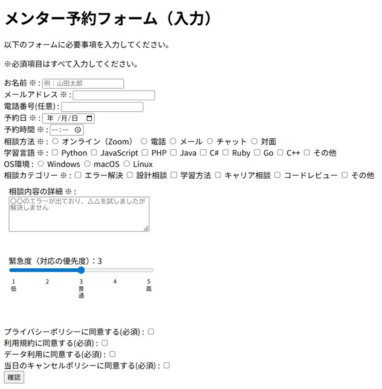
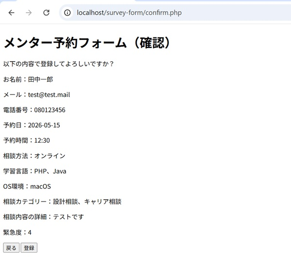
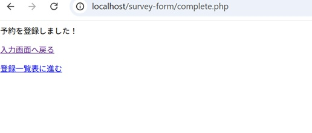
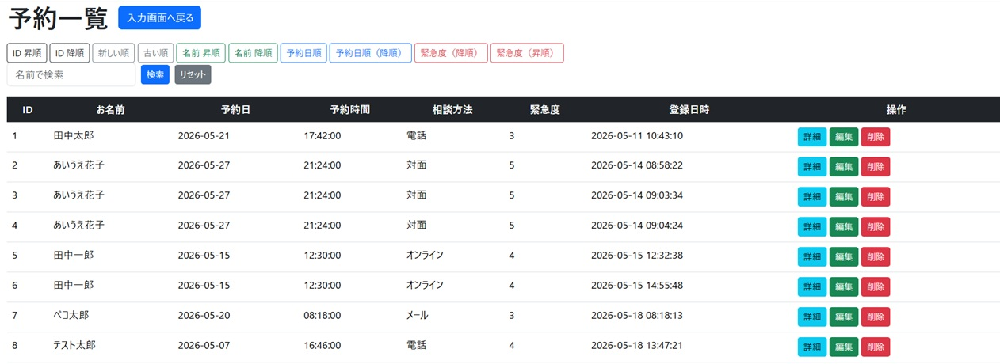

# Survey Form（メンター予約フォーム）

## 概要
PHP + MySQLで作成したメンター予約フォームです。  
入力内容のバリデーション、データ保存機能を実装しています。
今後も機能拡張を予定しています。
Qiitaで作成過程を公開しています。

※現在開発中のプロジェクトです。

## 機能
- メンター予約フォーム入力機能
- バリデーションチェック（未入力・形式チェック）
- 確認画面・完了画面表示
- データベース登録機能
- 予約データ一覧表示
- 名前検索機能
- 並び替え機能
  - ID順
  - 登録日時順
  - 予約日時順
  - 緊急度順

## 画面イメージ

### 入力画面（index.php）

メンター予約に必要な情報を入力する画面です。  
必須項目、チェックボックス、緊急度スライダーを配置しています。

### 確認画面（confirm.php）

入力された内容を確認する画面です。  
送信前に内容をチェックし、問題がなければ登録を行います。  
修正したい場合は入力画面へ戻ることもできます。

### 完了画面（complete.php）

データの登録完了を表示する画面です。  
登録一覧画面へ進む、または入力画面へ戻ることができます。

### データ表示画面（list.php）

登録された予約データを一覧表示する画面です。  
名前検索機能や並び替え機能を実装しています。

### 

## 実装予定
- 一覧表示
- 編集フォーム
- 削除機能
- 更新機能
- 印刷機能

## 使用技術
- PHP
- MySQL
- HTML / CSS
- JavaScript
- jQuery
- Bootstrap (導入予定)

## 工夫した点

### 入力しやすさ・見やすさ
- フォームのレイアウトを整理し、入力項目を視覚的に分かりやすく配置しました。
- スライダーの目盛りラベルがずれないように幅を調整し、数値と補足説明が縦に揃って見えるようにしました。
- スライダー操作時に緊急度の数値がリアルタイムで更新されるようにし、現在の選択値を直感的に把握できるようにしました。

### 入力チェック・UX改善
- 必須項目チェックや形式チェックを実装し、入力ミスを防げるようにしました。
- エラーメッセージを具体的に表示し、ユーザーが修正しやすいようにしました。
- チェックボックスの複数選択データを配列で受け取り、表示用に整形しました。

### データ検索・並び替え
- `ORDER BY` を利用し、ID順・登録日時順・予約日時順・緊急度順など、用途に応じた並び替え機能を実装しました。
- 予約日順では、同じ予約日の場合に予約時間も考慮するよう複合ソートを行いました。
- `LIKE` 句とプレースホルダーを使用し、安全な名前検索機能を実装しました。

### セキュリティ・DB操作
- `bindValue()` を利用し、SQLインジェクション対策を意識しました。
- PDOのプリペアドステートメントを使用し、安全にデータを登録・取得できるようにしました。

## 今後の課題

### セキュリティ・認証
- バリデーションおよびエスケープ処理の強化
- 認証・認可機能の追加
- 管理者・一般ユーザーの権限分離

### 一覧表示機能の改善
- ソート機能の改善
- フィルタリング機能の追加
- 検索結果件数の表示
- ページネーション対応
- 選択中ソートボタンのUI改善

### データ管理機能
- CSV / Excel形式での出力
- 一覧表の印刷機能
- メール送信機能の追加

### 入力機能の拡張
- 「その他」入力欄のDB保存対応

### ファイルアップロード機能
- ファイル添付機能の実装
- ドラッグ＆ドロップ対応
- サーバー保存およびDB連携

## 動作方法
1. XAMPPを起動
2. `htdocs`配下に配置
3. ブラウザで `http://localhost/surveyform` にアクセス

## 作者
- フレッカ （GitHub: frecca-dev）